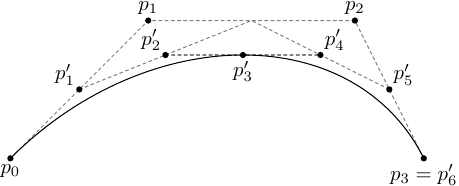

# Tables and Graphics {#sec-tables}

## Tables

The following section contains examples of tables. For more help building a table (or
anything else in this document), see the Quarto documentation on
[tables](https://quarto.org/docs/authoring/tables.html) or contact CUS.

You can write a table by hand in Markdown, or build it from code. To be numbered,
referenced, and listed in the List of Tables, a table needs a `tbl-` label and a caption.
This one is built in **R**; refer to it as @tbl-inheritance.

```{r}
#| label: tbl-inheritance
#| tbl-cap: "Correlation of inheritance factors between parents and child."
inheritance <- data.frame(
  Factor = c("Education", "Socio-economic status", "Income", "Family size",
             "Occupational prestige"),
  Correlation = c(-0.49, 0.28, 0.08, 0.19, 0.21),
  Inherited = c("Yes", "Slight", "No", "Slight", "Slight")
)
knitr::kable(inheritance, align = "lrl")
```

Tables can be longer than a page; Quarto (through LaTeX or Word) will break them across
pages and repeat the header row. @tbl-long is a hand-written Markdown table, with
math in the cells. It is trimmed for brevity from the chromium hexacarbonyl data
collected at Reed in 1998--1999; the last column is the ratio of intensity at vapor
pressure to intensity at 240 Torr.

| State | Laser wavelength | Buffer gas | Intensity ratio |
|:------------|:-------:|:-------:|------:|
| $z^{7}P^{\circ}_{4}$ | 266 nm | Argon | 1.5 |
| $z^{7}P^{\circ}_{2}$ | 355 nm | Argon | 0.57 |
| $y^{7}P^{\circ}_{3}$ | 266 nm | Argon | 1 |
| $y^{7}P^{\circ}_{3}$ | 355 nm | Argon | 0.14 |
| $z^{5}P^{\circ}_{3}$ | 355 nm | Helium | 0.02 |
| $z^{5}F^{\circ}_{4}$ | 266 nm | Argon | 1.4 |
| $z^{5}D^{\circ}_{4}$ | 355 nm | Helium | 0.65 |
| $y^{5}H^{\circ}_{7}$ | 266 nm | Argon | 0.17 |
| $a^{5}D_{3}$ | 266 nm | Argon | 0.71 |
| $a^{5}S_{2}$ | 355 nm | Argon | 1.5 |
| $e^{7}D_{5}$ | 355 nm | Helium | 3.5 |
| $f^{7}D_{4}$ | 355 nm | Argon | 0.2 |

: Chromium hexacarbonyl data collected in 1998--1999. {#tbl-long}

## Figures

If your thesis has a lot of figures, Quarto handles them well: it numbers them, lets you
refer to them, and builds a List of Figures. A figure needs a `fig-` label and a caption.

To get a figure from a statistics program such as JMP or SPSS, save the image as a PNG
or JPG (PDF images work in the PDF output but not in Word) and include it like this:

{#fig-subd width="60%"}

Refer to it as @fig-subd. Figures produced by code chunks work the same way. This one is
made in **R**:

```{r}
#| label: fig-r-plot
#| fig-cap: "Stopping distance of cars versus speed."
#| fig-alt: "Scatter plot of stopping distance rising with speed."
#| fig-width: 5
#| fig-height: 3.2
plot(dist ~ speed, data = cars, pch = 19,
     xlab = "Speed (mph)", ylab = "Stopping distance (ft)")
abline(lm(dist ~ speed, data = cars))
```

### Scaling figures

Set a figure's size with `width` (as a percentage of the text width or in inches), as
in @fig-small.

{#fig-small width="30%"}

### Common modifications

Captions can contain math and other formatting, as in @fig-arcs. To make a figure
appear in the List of Figures with a shorter title, keep the caption short.

{#fig-arcs width="45%"}
